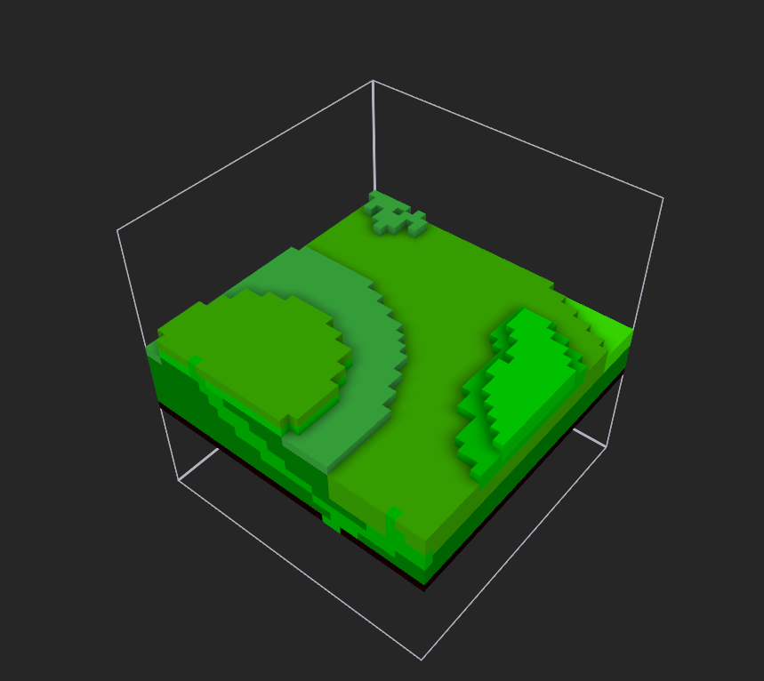

# VoxSlicer
Slice a MagicaVoxel project into smaller volumes.

## Usage: 

`VoxSlicer.exe SIZE FILE`

- SLICE represent the volume size of the exported regions. (Max 126)
- FILE the .vox file to process: 

Example : 

`VoxSlicer.exe 32 myfile.vox`

Before process: 

After process: 

